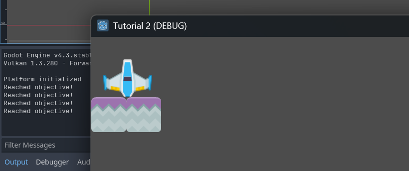
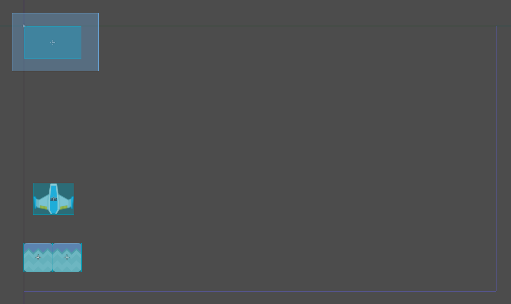
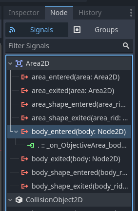
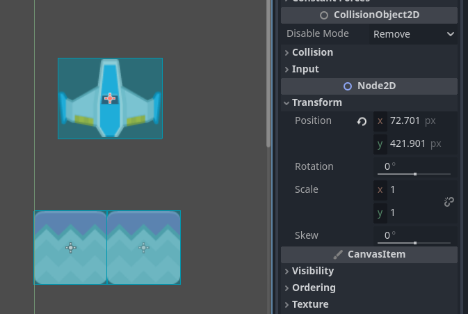
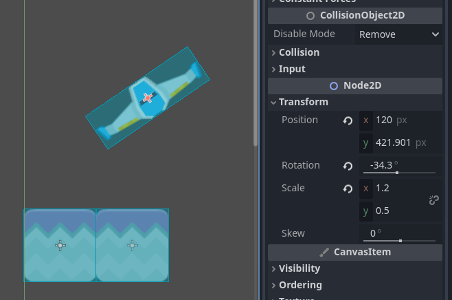
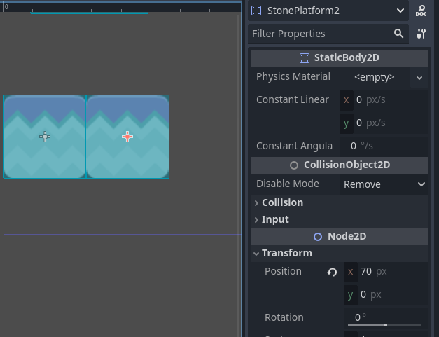

# Game Development - Tutorial 2

- **Name:** Feru Pratama Kartajaya
- **NPM:** 2106750351

---

## Latihan: Playtest

After inspecting the nodes and scene of the project, I tested the game out by clicking the **Play** button. Godot loaded a new window with the name "Tutorial 2 (DEBUG). The window featured the MainLevel scene as seen in the viewport. The only controls available are moving the platform up and down with the arrow keys. When the platform is moved up, the ship on top of the platform is also carried up. When the platform is moved down, the ship falls down as well.

The rate in which the ship goes down is different to the platform. This seems to be due to the different types of node used for each object. The PlatformBlue node belongs to the Node2D class, whose position can be directly manipulated. The platform's movement is defined in the PlatformBlue.gd script, where it's programmed to move linearly. On the other hand, the BlueShip node belongs to the RigidBody2D class. This node is a child of the Node2D class whose movement is dictated by the engine's physics calculations.

When the game started, the platform and ship are located at the bottom left of the screen. If the platform is moved such that the ship is now at the top left of the screen, a log appears in the Output panel with the message "Reached objective!". By moving the objects back down and up again repeatedly, the same log message continues to appear.



There is one node from the MainLevel scene that isn't immediately apparent in the game window, and that's the ObjectiveArea node. Looking at the viewport, we can see that the ObjectiveArea is placed at the top left of the game screen (marked by the blue border). This would indicate that an event is happening when the BlueShip node goes within with the ObjectiveArea node.



By checking the ObjectiveArea.gd script, we can see what's happening. The function _on_ObjectiveArea_body_entered(body) checks for whether or not a RigidBody2D body has entered the ObjectiveArea. If the name of said body is "BlueShip", then the game would print the message "Reached objective!" into the output. The BlueShip node is a RigidBody2D node, so it entering the ObjecttiveArea will trigger the message.

```
extends Area2D

func _on_ObjectiveArea_body_entered(body: RigidBody2D):
	if (body.name == "BlueShip"):
		print("Reached objective!")
```

However, having this method alone is not enough to create the interaction. ObjectiveArea needs to be told to use this method when a body has entered it. To do this, methods can be tied to node Signals that activate whenever a certain event happens. In this case, we want the method to be triggered when a body enters the area.




## Latihan: Memanipulasi Node dan Scene

> Scene BlueShip dan StonePlatform sama-sama memiliki sebuah child node bertipe Sprite. Apa fungsi dari node bertipe Sprite?

The Sprite node is used to define textures to display on the game screen.

> Root node dari scene BlueShip dan StonePlatform menggunakan tipe yang berbeda. BlueShip menggunakan tipe RigidBody2D, sedangkan StonePlatform menggunakan tipe StaticBody2D. Apa perbedaan dari masing-masing tipe node?

The difference lies in how movement is handled for each type. RigidBody2D relies on Godot's physics engine, where force needs to be applied to manipulate its movement. On the other hand, StaticBody2D is not affected by standard physics and will remain in place. This type of body needs to be moved manually, such is the case with StonePlatform using the PlatformBlue script.

> Ubah nilai atribut Mass pada tipe RigidBody2D secara bebas di scene BlueShip, lalu coba jalankan scene MainLevel. Apa yang terjadi?

I tried manipulating the Mass attribute to both smaller (0.1kg) and bigger (10kg, 100kg) values. In all cases, there doesn't seem to be a difference in behavior for the BlueShip. In the current setup, the only thing the BlueShip is capable of doing is falling down when the platform is lowered from underneath. In this case, the change of mass does not matter as mass is irrelevant when calculating a free fall motion. If a force were to be applied directly to the BlueShip, the change in mass would have an effect. However, since the setup doesn't play around with the forces acting upon BlueShip, the different masses are not being put to use.

> Ubah nilai atribut Disabled pada tipe CollisionShape2D di scene StonePlatform, lalu coba jalankan scene MainLevel. Apa yang terjadi?

After disabling the CollisionShape2D, the BlueShip will fall through the StonePlatform.

> Pada scene MainLevel, coba manipulasi atribut Position, Rotation, dan Scale milik node BlueShip secara bebas. Apa yang terjadi pada visualisasi BlueShip di Viewport?

After changing the three attributes through the inspector, we can see that the transformations towards the node is reflected within the viewport accordingly. As for what each attribute does: Position determines the location of a node within the viewport, Rotation determines the degree of rotation of a node from its center point, and Scale determines the size multipliers applied to a node.





> Pada scene MainLevel, perhatikan nilai atribut Position node PlatformBlue, StonePlatform, dan StonePlatform2. Mengapa nilai Position node StonePlatform dan StonePlatform2 tidak sesuai dengan posisinya di dalam scene (menurut Inspector) namun visualisasinya berada di posisi yang tepat?

When a node becomes the child of a parent node, its Position attribute will reflect its position relative to the parent node instead of the node's global position. To get the global position of the child node, we can simply add its relative position with the global position of the parent Node. For example, the PlatformBlue node is located at the global coordinates (35, 565) and the StonePlatform2 node is located at coordinates (70,0) relative to PlatformBlue. Thus, we can conclude that StonePlatform2 is at (35,565) + (70,0) = (105,565) globally.





## Latihan Mandiri: Membuat Level Baru

Below are a list of things I've implemented to the base project:

- Added new ship type "GreenShip" with different dimensions
- Added new platform types "Snow" and "Grass"
- Modified Level 1 and added Levels 2-5
- Added textual information for mechanics and level numbers
- Added an external font to use with Rich Text
- Provided visual cue to ObjectiveArea
- Implemented system for transitioning between levels through ObjectiveArea
- Added DeathPlane to restart level when ship goes out of bounds
